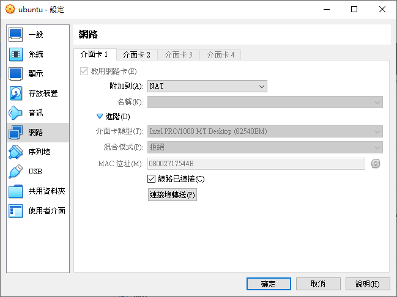
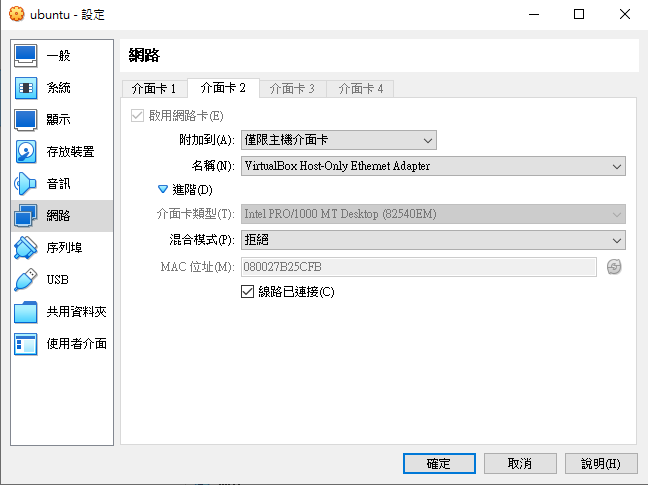
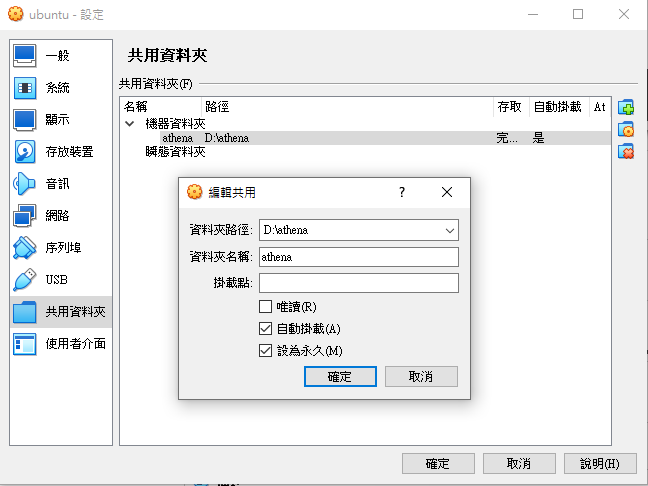

## Prototype - backend

<br>

語言:

* [English](README_en.md)

---

<br>

# 介紹

- 後端架構，提供遊戲開發所需的後端功能

<br><br>

# 內容

| 資料夾 | 功能 |
|:--|:--|
|api|建構 Api Server 相關代碼|
|bundles|提供 frontend 下載資源的存放位置|
|file|建構 FTP Server 相關代碼，提供 frontend 下載 bundles 資料夾內的檔案服務|
|mongodb|建構 Mongo DB 的相關文件，Schema 設計規則與問題排除方式|
|nginx|反向代理伺服 config 存放位置，解決 cors 問題所設定|
|ssl|ssl 金鑰的存放位置|
|swagger|swagger 腳本存放位置|

<br><br>

# 使用方式

- 安裝 docker

- 在目錄下輸入 ``` docker-compose up -d ```

<br><br>

# 環境變數 (docker-compose.yml)

- go_api

| 資料夾 | 功能 |
|:--|:--|
|API_PORT|Api Server 開放的 Port|
|SSL_CERTIFICATION|ssl 憑證位置|
|SSL_PRIVATE_KEY|ssl 金鑰位置|
|JWT_SIGNING_KEY|Json web token 的簽名字串|
|JWT_CLAIMS_KEY|Json web token 的存取索引|
|SQL_DRIVER|指定的 SQL Driver|
|SQL_USERNAME|SQL 登入帳號|
|SQL_PASSWORD|SQL 登入密碼|
|SQL_ADDRESS|SQL 網址|
|SQL_PORT|SQL 開放的 Port|
|SQL_DATABASE|存取 SQL 的 table 表|
|SQL_TIMEOUT|每筆 SQL 指令允許的最大等待時間|
|SQL_MAXLIFETIME|每個 SQL 連線可以存活的最大時間(秒)|
|SQL_MAXOPENCONNECT|SQL 最大的連線數|
|SQL_MAXIDLECONNECT|SQL 最大的閒置連線數|
|REDIS_CACHE_ADDRESS|Redis cache 網址|
|REDIS_CACHE_PORT|Redis 開放的 Port|
|REDIS_CACHE_EXPIRATION|每個 Cahae 存活時間(秒)|

<br><br>

- go_api

| 資料夾 | 功能 |
|:--|:--|
|FILE_PORT|資源下載的 Port|

<br><br>

- swagger_ui

| 資料夾 | 功能 |
|:--|:--|
|API_URL|swagger 腳本位置|

<br><br>

# TODO

- 建構 Jenkins，提供開發所需的自動化操作
- 建構 gRPC Server，提供強連線服務

<br><br>

# 後端環境設定

- 使用 virtualbox, os image 使用 ubuntu-22.04.2-live-server-amd64
- 安裝完畢後 安裝 ifconfig (如果有可跳過)
```console
> sudo apt install net-tools
```
- 安裝完畢後，檢查網路設定 (enp0s8 的內容可能有點不一樣，下面顯示設定後的結果，要記錄的是 enp0s8 這個標籤)
```ps
> ifconfig -a
enp0s3: flags=4163<UP,BROADCAST,RUNNING,MULTICAST>  mtu 1500
        inet 10.0.2.15  netmask 255.255.255.0  broadcast 10.0.2.255
        inet6 fe80::a00:27ff:fe17:544e  prefixlen 64  scopeid 0x20<link>
        ether 08:00:27:17:54:4e  txqueuelen 1000  (Ethernet)
        RX packets 14286  bytes 17757525 (17.7 MB)
        RX errors 0  dropped 0  overruns 0  frame 0
        TX packets 2743  bytes 296919 (296.9 KB)
        TX errors 0  dropped 0 overruns 0  carrier 0  collisions 0

enp0s8: flags=4163<UP,BROADCAST,RUNNING,MULTICAST>  mtu 1500
        inet 192.168.56.101  netmask 255.255.255.0  broadcast 192.168.56.255
        inet6 fe80::a00:27ff:feb2:5cfb  prefixlen 64  scopeid 0x20<link>
        ether 08:00:27:b2:5c:fb  txqueuelen 1000  (Ethernet)
        RX packets 31  bytes 2532 (2.5 KB)
        RX errors 0  dropped 0  overruns 0  frame 0
        TX packets 17  bytes 1286 (1.2 KB)
        TX errors 0  dropped 0 overruns 0  carrier 0  collisions 0

lo: flags=73<UP,LOOPBACK,RUNNING>  mtu 65536
        inet 127.0.0.1  netmask 255.0.0.0
        inet6 ::1  prefixlen 128  scopeid 0x10<host>
        loop  txqueuelen 1000  (Local Loopback)
        RX packets 112  bytes 9428 (9.4 KB)
        RX errors 0  dropped 0  overruns 0  frame 0
        TX packets 112  bytes 9428 (9.4 KB)
        TX errors 0  dropped 0 overruns 0  carrier 0  collisions 0
```
<br>

- 修改網路設定
```console
> sudo nano /etc/netplan/00-installer-config.yaml
```
修改內容如下
```yaml
# This is the network config written by 'subiquity'
network:
  ethernets:
    enp0s3:
      dhcp4: true
    enp0s8:
      dhcp4: false
      addresses: [192.168.56.101/24]
  version: 2
```
如此，guest os 的網路位置就指定成 192.168.56.101<br>
完成後記得套用修改設定
```console
> sudo netplan apply
```
- virtualbox 內的設定

<br>

<br>

- 設定共享資料夾
```console
> sudo nano /etc/fstab
```
修改檔案內容為
```ps
# /etc/fstab: static file system information.
#
# Use 'blkid' to print the universally unique identifier for a
# device; this may be used with UUID= as a more robust way to name devices
# that works even if disks are added and removed. See fstab(5).
#
# <file system> <mount point>   <type>  <options>       <dump>  <pass>
# / was on /dev/ubuntu-vg/ubuntu-lv during curtin installation
/dev/disk/by-id/dm-uuid-LVM-GThEM2stqT7JWfeeREB09nYQ50iPGZk0B9kyw5SbeHnB06E9MZmGdolI3EM2ZE1x / ext4 defaults 0 1
# /boot was on /dev/sda2 during curtin installation
/dev/disk/by-uuid/4aef9785-d32f-4c95-a7d2-3dccab224eb7 /boot ext4 defaults 0 1
/swap.img       none    swap    sw      0       0
[共享資料夾名稱] [os 內對應的位置] vboxsf defaults 0 0
```
假設共享資料夾名稱 athena，ubuntu 內對應的資料夾是 /home/sigma/athena/，就輸入 <br>
```athena /home/sigma/athena/ vboxsf defaults 0 0```
<br>

- virtualbox 內的設定

<br>

- 設定 docker 指令的操作權限
```console
> sudo groupadd docker
> sudo usermod -aG docker [帳號名稱]
> sudo reboot now
```
