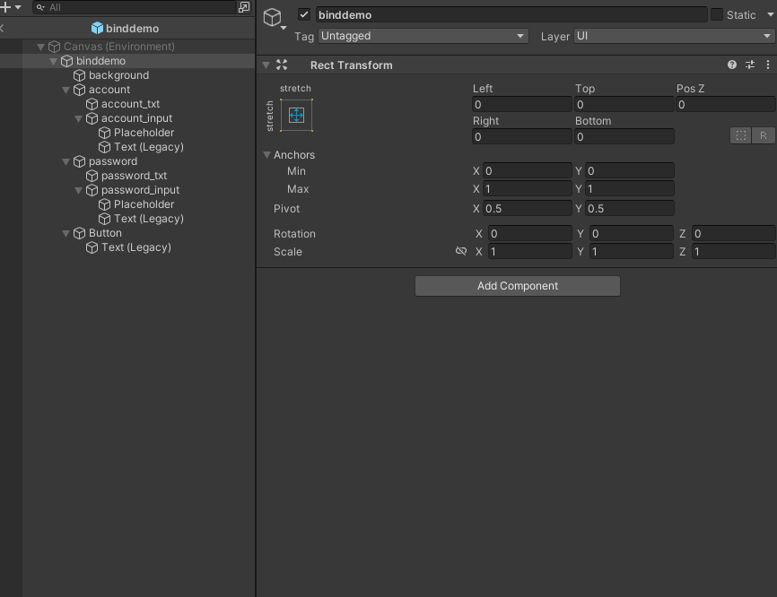

# Bind

## 介紹

- 實現 MVP Design Pattern 的基本元件

## 原理

- 將遊戲內容分成 model (3D 模型) - View (UI 介面) - Presenter (程式碼)
- 每個部份各自獨立，透過 Presenter 去操作 model 和 View。
- 為了讓 Presnter 能夠操作 model 和 View，需要再 model 和 View 上面標記要操作的元件位置
- 透過掛載在 model 和 View 上面的 bind component，讓 Presenter 能夠找到該元件並進行操作

## 內容

- bind component 主要有 3 個元件，BindContainer、BindNode 和 BindElement

    | bind component | 功能 |
    |:-:|:--|
    |BindElement|基礎元件，標記後可透過查詢 BindElement 上的 identifier，來取得該元件的 GameObject|
    |BindNode|會收集該物件下，所有有掛載 bind component 的子物件，並做成一個 List 儲存，可用來對複數個物件進行存取|
    |BindContainer|Presenter 操作入口，會紀錄該物件下，所有有掛載 bind component 的子物件|

- 掛載方式 :
  
  


- 操作方法 :

    ```
    // 首先，宣告一個繼承 Presenter 的 class
    class TutorialPresenter : Presenter
    {
        // 宣告成員變數
        Text message;

        public TutorialPresenter()
        {
            // 在建構子內 初始化成員變數
            message = null;
        }

        protected override void onBindingCompleted()
        {
            // 當 binding 完成 (i.e.取得目標(model 或 view)的所有 bind component) 
            // 會呼叫 onBindingCompleted
            base.onBindingCompleted();

            // 可透過 getBindData<T> 取得指定 identifier 對應物件
            message = getBindData<Text>("msg_txt");
        }
    }
    ```

    ```    
    void onLoadCompleted(GameObject go)
    {
        // 在資源載入完成後，透過呼叫 PresenterMaker.Binding<T>，將 Presenter 和目標資源 bind
        var presenter = PresenterMaker.Binding<TutorialPresenter>(go);
    }
    ```

- 常見問題 :

    - Q : 修改 Container (node) 上 componet 清單的 identifier，無法反映在對應的 componet (Hierarchy 顯示沒有變更)
    - A : 由於 Unity Serializable 的架構限制，當物件重新載入時，對應的連結會被切斷，請重新點擊 Container Inspector 的 re-bind
