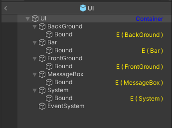

# UI

## 介紹

- 實現 UI 管理架構工具

## 說明

- 需要提供 IAssetLoader 做資源載入
- 需要提供 UI [圖層結構](#圖層結構)
- 每個完整功能的 UI，對其操作都需繼承類別 [UiPresenter](../Bind/Presenter/UiPresenter/README.md)
- 每個圖層的規則定義在 [ViewLayerOperator](./ViewLayerOperator/README.md)

## 內容

- 成員函數 :

    | 函數名稱 | 功能 |
    |:-:|:--|
    |Open|開啟指定 UI 介面|
    |Close|關閉指定 UI 介面|
    |ClearLayer|關閉指定圖層的所有 UI 介面|

## 用法

### 宣告
```cs
// 產生實體
var uiManager = Singleton<UiManager>.Instance;
var assetLoader = Singleton<AddressableLoader>.Instance;
// 設定 AssetLoader
uiManager.InjectAssetLoader(assetLoader);
// 設定圖層結構
assetLoader.Load<GameObject>("UI.prefab", (raw) => {
    var viewLayers = GameObject.Instantiate<GameObject>(raw as GameObject);
    GameServices.UI.InjectViewLayers(viewLayers);
});
```

### UI 介面操作

- 參考 [UiPresenter](../Bind/Presenter/UiPresenter/README.md)

## 補充

### 圖層結構

- 一個記錄著每個 UI 的掛載位置及其圖層順序的 Prefab
- 透過 [bind](../Bind/README.md) 紀錄每個圖層的掛載位置資料
- 圖層數量與名稱的宣告透過 [Enum ViewLayer](./IView.cs#L7)
