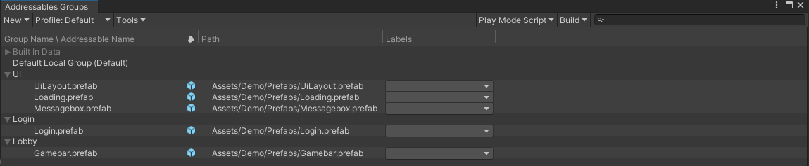

## Prototype - frontend

  

# 介紹

- 前端程式代碼，使用 Unity3D 開發

  

# 使用方式

- 可參考 [Demo](./Assets/Demo/) 資料夾內的範例

- 使用前需要設定 addressable (範例使用 addressable 作為資源載入工具)

- 範例提供一個玩家 signin (login) 和取得玩家遊戲內貨幣資訊的功能演示

- 範例內容會隨框架擴充隨時新增(修改)

- 框架使用 MVP 架構，實作方式可參考 [Binding](./Assets/Scripts/Utility/Bind/README.md) 說明

  

# 常見問題

- 框架如何實現 MonoBehaviour::Update 的功能

考慮到 Update 的效能問題 [10000 Update() calls](https://blog.unity.com/engine-platform/10000-update-calls)，Presenter 不實作每個 frame 呼叫的 method，如果有需要再每個 frame 作運算，提供下述二種方式

1.自訂繼承 MonoBehaviour 的 Manager，然後在 Update 呼叫所有登錄的 callback function

2.使用 [UniRx](https://github.com/neuecc/UniRx) (推薦)

  

# TODO

## 之後預計擴充的功能與其實現方式

 

- Presenter (Node) 代碼生成

在 Presenter (Node) 的 Inspector 上，新增一個按鍵，點擊後可自動產生對應的程式代碼

- 多語系

由於需要對應所有資源載入工具，所以目前想法是將每個語系資源分開包裝，然後在 presenter 根據語系決定載入何種資源 (參數 ViewPath)

- 優化資源載入(更新)流程

目前使用 addressable 作為資源載入(更新)工具，但更新方法完全 addressable 的基本設計，無法達成動態更新下載地址、資源檔案加密等額外功能，預計做此方面的功能擴張

- 新增 Server 封包的本地端讀(寫)範例

目前架構是有這方面的規劃，也提供了 [相關的方法](./Assets/Scripts/Utility/Network/WebRequest/Model/)，但 Demo 中並沒也實際的操作，未來會根據 backend 的擴充，提供相關的範例

- 3D 物件的管理

目前只提供遊戲 UI 操作，3D 物件基本上會同 UI 操作一樣，使用 MVP 架構，並提供一個類似 [UiManager](./Assets/Scripts/Utility/UI/README.md) 的管理器，來管理所有 3D 物件

