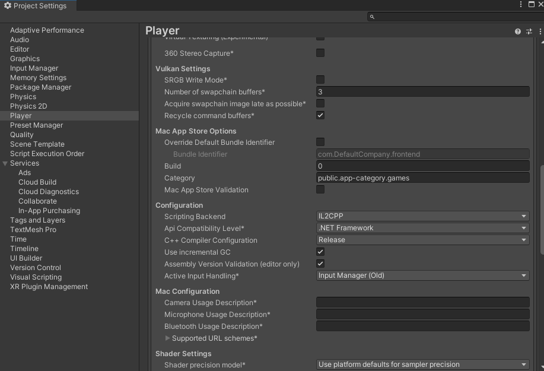

## Prototype - gRPC

 

語言:

* [English](README_en.md)

---

 

# 介紹

- gRPC Unity 用代碼生成工具安裝與操作說明

  

# Unity 設定

- 開啟 [Artifacts for gRPC Build](https://packages.grpc.io/archive/2019/11/6950e15882f28e43685e948a7e5227bfcef398cd-6d642d6c-a6fc-4897-a612-62b0a3c9026b/index.xml) 網頁，下載 `grpc_unity_package.2.26.0-dev.zip`

- 解壓縮後，將 Plugins 資料夾複製到 Unity Assets 資料夾下

- 開啟 Unity 的 Project Setting/Player/Other Settings，將 Api Compatibility Level 設定成 `.NET Framework` (unity 2021.3.19f1)

 

# 安裝 grpc-tools (window 環境)

- 開啟 [Artifacts for gRPC Build](https://packages.grpc.io/archive/2019/11/6950e15882f28e43685e948a7e5227bfcef398cd-6d642d6c-a6fc-4897-a612-62b0a3c9026b/index.xml) 網頁，下載 `Grpc.Tools.2.26.0-dev201911231120.nupkg`

- 解壓縮檔案(可以使用 7-Zip)，進入 tools/windows_x86/ 資料夾內，複製 `protoc.exe` 和 `grpc_csharp_plugin.exe` 到此資料夾 (和 `generator.bat` 相同位置)

 

# 使用方式

- 將自訂好的 proto 檔案放到 src 資料夾內，然後執行 `generator.bat` (滑鼠雙擊)

- 完成後會自動生成 grpc 資料夾，生成的 csharp 代碼會放在 grpc 資料夾內

  

# 備註

- 為何要將代碼生成分為前、後端，不統一整合

由於官方提供的 Unity plugin 版本只到 2.26，離目前(2023/7) gRPC 最新版本有一段差距，因此最新版產生出來的代碼無法應用在 Unity， 只能先用兩個環境來產生前、後端代碼

 

- 為何要設定 Api Compatibility Level 為 `.NET Framework`

因為 gRPC 支援 `.NET Framework 4.5` 以上版本，但 unity 2021.3.19f1 (筆者目前使用的環境) 並沒有 `.NET Framework 4.5` 選項，建議將 Unity 版本更新到 2022.2 以後，才會有對應選項
